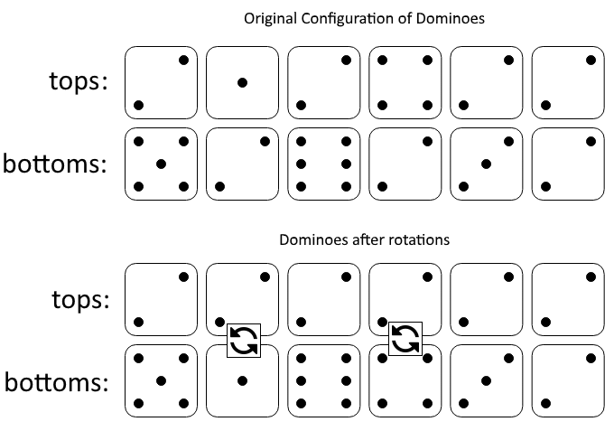

# [1007.Minimum Domino Rotations For Equal Row][title]

## Description
In a row of dominoes, `tops[i]` and `bottoms[i]` represent the top and bottom halves of the __i<sup>th</sup>__ domino. (A domino is a tile with two numbers from 1 to 6 - one on each half of the tile.)

We may rotate the __i<sup>th</sup>__ domino, so that `tops[i]` and `bottoms[i]` swap values.

Return the minimum number of rotations so that all the values in `tops` are the same, or all the values in `bottoms` are the same.

If it cannot be done, return `-1`.

**Example 1:**  


```
Input: tops = [2,1,2,4,2,2], bottoms = [5,2,6,2,3,2]
Output: 2
Explanation: 
The first figure represents the dominoes as given by tops and bottoms: before we do any rotations.
If we rotate the second and fourth dominoes, we can make every value in the top row equal to 2, as indicated by the second figure.
```

**Example 2:**
```
Input: tops = [3,5,1,2,3], bottoms = [3,6,3,3,4]
Output: -1
Explanation: 
In this case, it is not possible to rotate the dominoes to make one row of values equal.
```

## 结语

如果你同我一样热爱数据结构、算法、LeetCode，可以关注我 GitHub 上的 LeetCode 题解：[awesome-golang-algorithm][me]

[title]: https://leetcode.com/problems/minimum-domino-rotations-for-equal-row/
[me]: https://github.com/kylesliu/awesome-golang-algorithm
