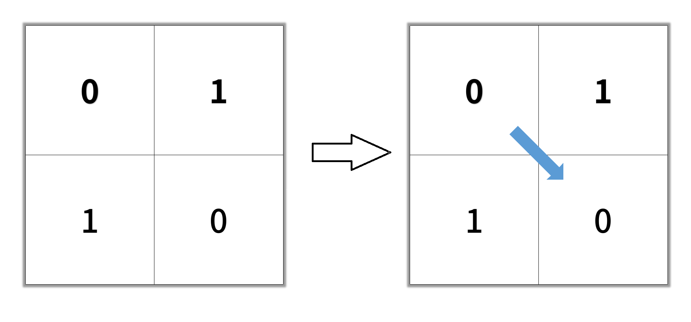
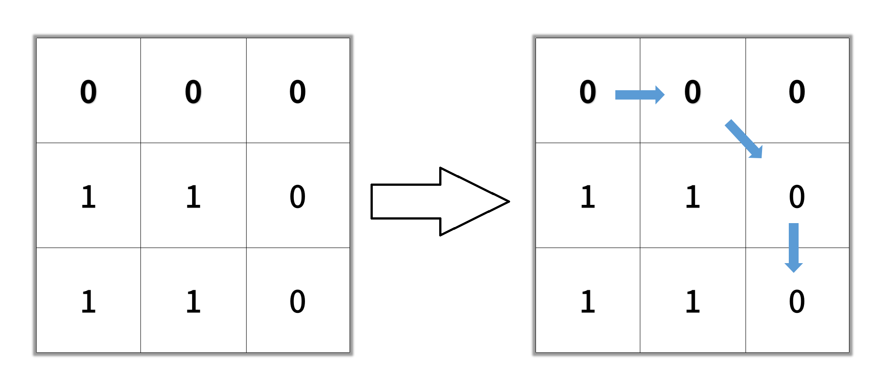

# [1091.Shortest Path in Binary Matrix][title]

## Description
Given an `n x n` binary matrix `grid`, return the length of the shortest **clear path** in the matrix. If there is no clear path, return `-1`.

A **clear path** in a binary matrix is a path from the **top-left** cell (i.e., `(0, 0)`) to the **bottom-right** cell (i.e., `(n - 1, n - 1)`) such that:

- All the visited cells of the path are `0`.
- All the adjacent cells of the path are **8-directionally** connected (i.e., they are different and they share an edge or a corner).

The **length of a clear path** is the number of visited cells of this path.

**Example 1:**  



```
Input: grid = [[0,1],[1,0]]
Output: 2
```

**Example 2:**  



```
Input: grid = [[0,0,0],[1,1,0],[1,1,0]]
Output: 4
```

**Example 3:**

```
Input: grid = [[1,0,0],[1,1,0],[1,1,0]]
Output: -1
```

## 结语

如果你同我一样热爱数据结构、算法、LeetCode，可以关注我 GitHub 上的 LeetCode 题解：[awesome-golang-algorithm][me]

[title]: https://leetcode.com/problems/shortest-path-in-binary-matrix/
[me]: https://github.com/kylesliu/awesome-golang-algorithm
