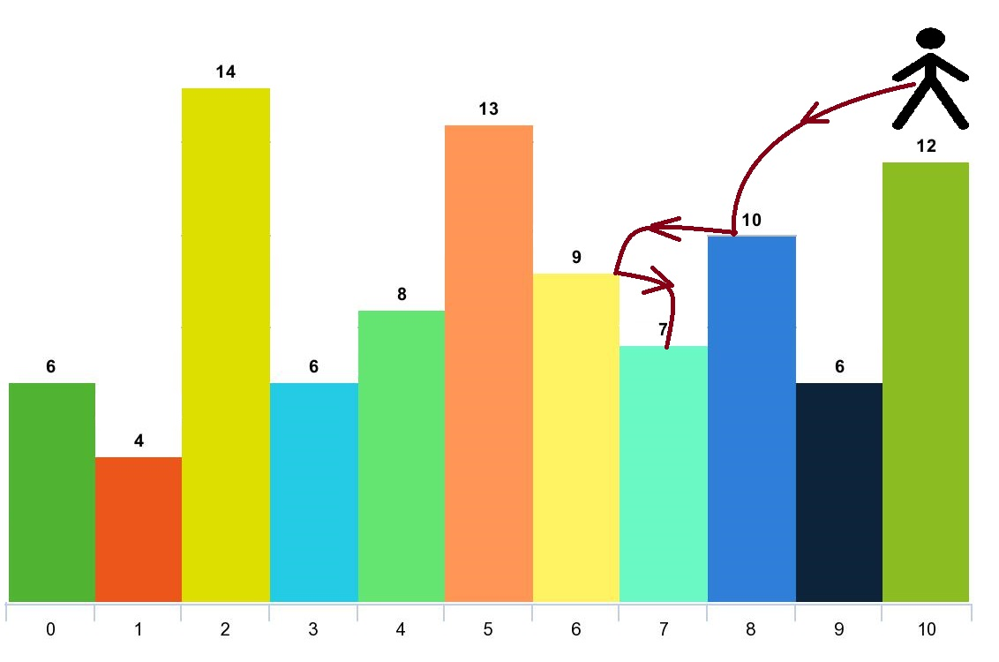

# [1340.Jump Game V][title]

## Description
Given an array of integers `arr` and an integer `d`. In one step you can jump from index `i` to index:

- `i + x` where: `i + x < arr.length` and  `0 < x <= d`.
- `i - x` where: `i - x >= 0` and  `0 < x <= d`.

In addition, you can only jump from index `i` to index j if `arr[i] > arr[j]` and `arr[i] > arr[k]` for all indices `k` between `i` and `j` (More formally `min(i, j) < k < max(i, j))`.

You can choose any index of the array and start jumping. Return the maximum number of indices you can visit.

Notice that you can not jump outside of the array at any time.

**Example 1:**  



```
Input: arr = [6,4,14,6,8,13,9,7,10,6,12], d = 2
Output: 4
Explanation: You can start at index 10. You can jump 10 --> 8 --> 6 --> 7 as shown.
Note that if you start at index 6 you can only jump to index 7. You cannot jump to index 5 because 13 > 9. You cannot jump to index 4 because index 5 is between index 4 and 6 and 13 > 9.
Similarly You cannot jump from index 3 to index 2 or index 1.
```

**Example 2:**

```
Input: arr = [3,3,3,3,3], d = 3
Output: 1
Explanation: You can start at any index. You always cannot jump to any index.
```

**Example 3:**

```
Input: arr = [7,6,5,4,3,2,1], d = 1
Output: 7
Explanation: Start at index 0. You can visit all the indicies.
```

## 结语

如果你同我一样热爱数据结构、算法、LeetCode，可以关注我 GitHub 上的 LeetCode 题解：[awesome-golang-algorithm][me]

[title]: https://leetcode.com/problems/jump-game-v/
[me]: https://github.com/kylesliu/awesome-golang-algorithm
