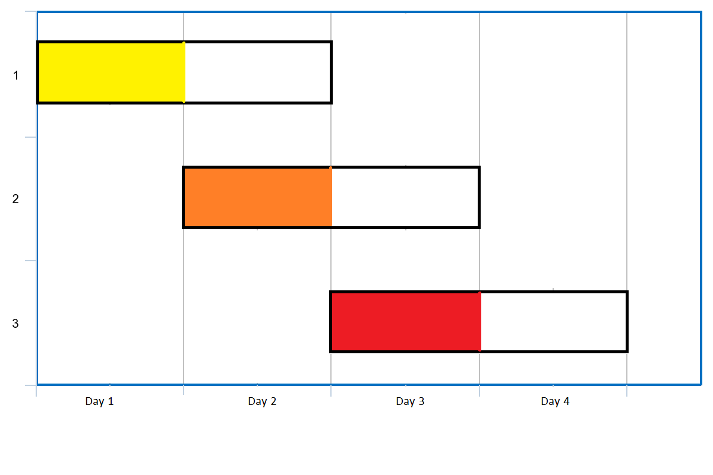

# [1353.Maximum Number of Events That Can Be Attended][title]

## Description
You are given an array of `events` where `events[i] = [startDayi, endDayi]`. Every event `i` starts at `startDayi` and ends at `endDayi`.

You can attend an event `i` at any day `d` where `startTimei <= d <= endTimei`. You can only attend one event at any time `d`.

Return the maximum number of events you can attend.

**Example 1:**  



```
Input: events = [[1,2],[2,3],[3,4]]
Output: 3
Explanation: You can attend all the three events.
One way to attend them all is as shown.
Attend the first event on day 1.
Attend the second event on day 2.
Attend the third event on day 3.
```

**Example 2:**

```
Input: events= [[1,2],[2,3],[3,4],[1,2]]
Output: 4
```

## 结语

如果你同我一样热爱数据结构、算法、LeetCode，可以关注我 GitHub 上的 LeetCode 题解：[awesome-golang-algorithm][me]

[title]: https://leetcode.com/problems/maximum-number-of-events-that-can-be-attended/
[me]: https://github.com/kylesliu/awesome-golang-algorithm
