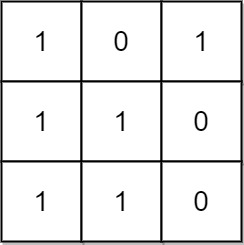

# [1504.Count Submatrices With All Ones][title]

## Description
Given an `m x n` binary matrix `mat`, return the number of **submatrices** that have all ones.

**Example 1:**  



```
Input: mat = [[1,0,1],[1,1,0],[1,1,0]]
Output: 13
Explanation: 
There are 6 rectangles of side 1x1.
There are 2 rectangles of side 1x2.
There are 3 rectangles of side 2x1.
There is 1 rectangle of side 2x2. 
There is 1 rectangle of side 3x1.
Total number of rectangles = 6 + 2 + 3 + 1 + 1 = 13.
```

**Example 2:**  


```
Input: mat = [[0,1,1,0],[0,1,1,1],[1,1,1,0]]
Output: 24
Explanation: 
There are 8 rectangles of side 1x1.
There are 5 rectangles of side 1x2.
There are 2 rectangles of side 1x3. 
There are 4 rectangles of side 2x1.
There are 2 rectangles of side 2x2. 
There are 2 rectangles of side 3x1. 
There is 1 rectangle of side 3x2. 
Total number of rectangles = 8 + 5 + 2 + 4 + 2 + 2 + 1 = 24.
```

## 结语

如果你同我一样热爱数据结构、算法、LeetCode，可以关注我 GitHub 上的 LeetCode 题解：[awesome-golang-algorithm][me]

[title]: https://leetcode.com/problems/count-submatrices-with-all-ones/
[me]: https://github.com/kylesliu/awesome-golang-algorithm
