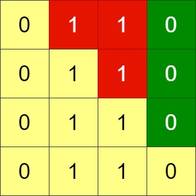

# [1536.Minimum Swaps to Arrange a Binary Grid][title]

## Description
Given an `n x n` binary `grid`, in one step you can choose two **adjacent rows** of the grid and swap them.

A grid is said to be **valid** if all the cells above the main diagonal are **zeros**.

Return the minimum number of steps needed to make the grid valid, or **-1** if the grid cannot be valid.

The main diagonal of a grid is the diagonal that starts at cell `(1, 1)` and ends at cell `(n, n)`.

**Example 1:**  


```
Input: grid = [[0,0,1],[1,1,0],[1,0,0]]
Output: 3
```

**Example 2:**  



```
Input: grid = [[0,1,1,0],[0,1,1,0],[0,1,1,0],[0,1,1,0]]
Output: -1
Explanation: All rows are similar, swaps have no effect on the grid.
```

**Example 3:**  


```
Input: grid = [[1,0,0],[1,1,0],[1,1,1]]
Output: 0
```

## 结语

如果你同我一样热爱数据结构、算法、LeetCode，可以关注我 GitHub 上的 LeetCode 题解：[awesome-golang-algorithm][me]

[title]: https://leetcode.com/problems/minimum-swaps-to-arrange-a-binary-grid/
[me]: https://github.com/kylesliu/awesome-golang-algorithm
