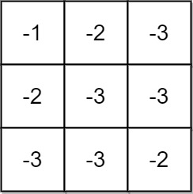
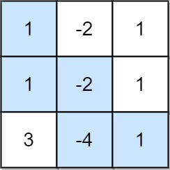
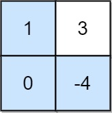

# [1594.Maximum Non Negative Product in a Matrix][title]

## Description
You are given a `m x n` matrix grid. Initially, you are located at the top-left corner `(0, 0)`, and in each step, you can only **move right or down** in the matrix.

Among all possible paths starting from the top-left corner (`0, 0`) and ending in the bottom-right corner (`m - 1, n - 1`), find the path with the **maximum non-negative product**. The product of a path is the product of all integers in the grid cells visited along the path.

Return the maximum non-negative product **modulo** `10^9 + 7`. If the maximum product is **negative**, return `-1`.

Notice that the modulo is performed after getting the maximum product.

**Example 1:**  



```
Input: grid = [[-1,-2,-3],[-2,-3,-3],[-3,-3,-2]]
Output: -1
Explanation: It is not possible to get non-negative product in the path from (0, 0) to (2, 2), so return -1.
```

**Example 2:**  



```
Input: grid = [[1,-2,1],[1,-2,1],[3,-4,1]]
Output: 8
Explanation: Maximum non-negative product is shown (1 * 1 * -2 * -4 * 1 = 8).
```

**Example 3:**  



```
Input: grid = [[1,3],[0,-4]]
Output: 0
Explanation: Maximum non-negative product is shown (1 * 0 * -4 = 0).
```

## 结语

如果你同我一样热爱数据结构、算法、LeetCode，可以关注我 GitHub 上的 LeetCode 题解：[awesome-golang-algorithm][me]

[title]: https://leetcode.com/problems/maximum-non-negative-product-in-a-matrix/
[me]: https://github.com/kylesliu/awesome-golang-algorithm
