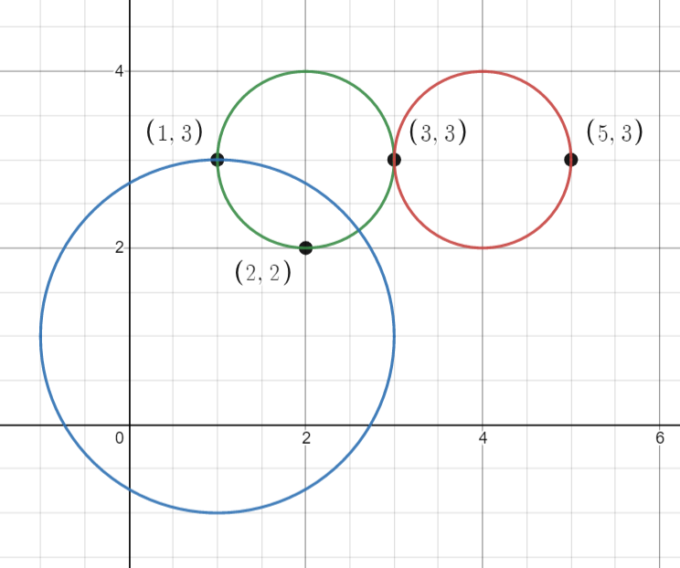

# [1828.Queries on Number of Points Inside a Circle][title]

## Description
You are given an array `points` where `points[i] = [xi, yi]` is the coordinates of the `ith` point on a 2D plane. Multiple points can have the **same** coordinates.

You are also given an array `queries` where `queries[j] = [xj, yj, rj]` describes a circle centered at `(xj, yj)` with a radius of `rj`.

For each query `queries[j]`, compute the number of points **inside** the `jth` circle. Points **on the border** of the circle are considered **inside**.

Return an array `answer`, where `answer[j]` is the answer to the `jth` query.

**Example 1:**  



```
Input: points = [[1,3],[3,3],[5,3],[2,2]], queries = [[2,3,1],[4,3,1],[1,1,2]]
Output: [3,2,2]
Explanation: The points and circles are shown above.
queries[0] is the green circle, queries[1] is the red circle, and queries[2] is the blue circle.
```

**EXample 2:**  


```
Input: points = [[1,1],[2,2],[3,3],[4,4],[5,5]], queries = [[1,2,2],[2,2,2],[4,3,2],[4,3,3]]
Output: [2,3,2,4]
Explanation: The points and circles are shown above.
queries[0] is green, queries[1] is red, queries[2] is blue, and queries[3] is purple.
```

## 结语

如果你同我一样热爱数据结构、算法、LeetCode，可以关注我 GitHub 上的 LeetCode 题解：[awesome-golang-algorithm][me]

[title]: https://leetcode.com/problems/queries-on-number-of-points-inside-a-circle/
[me]: https://github.com/kylesliu/awesome-golang-algorithm
