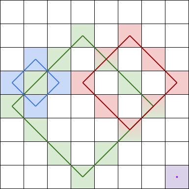
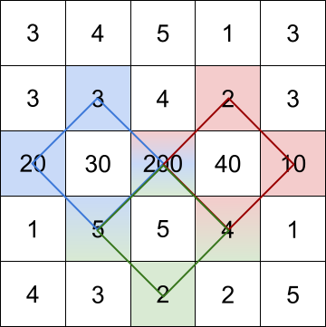
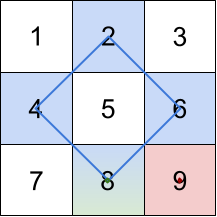

# [1878.Get Biggest Three Rhombus Sums in a Grid][title]

## Description
You are given an `m x n` integer matrix `grid`.

A **rhombus sum** is the sum of the elements that form **the border** of a regular rhombus shape in `grid`. The rhombus must have the shape of a square rotated 45 degrees with each of the corners centered in a grid cell. Below is an image of four valid rhombus shapes with the corresponding colored cells that should be included in each **rhombus sum**:



Note that the rhombus can have an area of 0, which is depicted by the purple rhombus in the bottom right corner.

Return the biggest three **distinct rhombus sums** in the grid in **descending order**. If there are less than three distinct values, return all of them.

**Example 1:**  



```
Input: grid = [[3,4,5,1,3],[3,3,4,2,3],[20,30,200,40,10],[1,5,5,4,1],[4,3,2,2,5]]
Output: [228,216,211]
Explanation: The rhombus shapes for the three biggest distinct rhombus sums are depicted above.
- Blue: 20 + 3 + 200 + 5 = 228
- Red: 200 + 2 + 10 + 4 = 216
```

**Example 2:**  



```
Input: grid = [[1,2,3],[4,5,6],[7,8,9]]
Output: [20,9,8]
Explanation: The rhombus shapes for the three biggest distinct rhombus sums are depicted above.
- Blue: 4 + 2 + 6 + 8 = 20
- Red: 9 (area 0 rhombus in the bottom right corner)
- Green: 8 (area 0 rhombus in the bottom middle)
```

**Example 3:**

```
Input: grid = [[7,7,7]]
Output: [7]
Explanation: All three possible rhombus sums are the same, so return [7].
```

## 结语

如果你同我一样热爱数据结构、算法、LeetCode，可以关注我 GitHub 上的 LeetCode 题解：[awesome-golang-algorithm][me]

[title]: https://leetcode.com/problems/get-biggest-three-rhombus-sums-in-a-grid/
[me]: https://github.com/kylesliu/awesome-golang-algorithm
