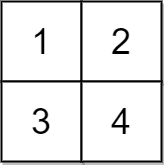

# [2033.Minimum Operations to Make a Uni-Value Grid][title]

## Description
You are given a 2D integer `grid` of size `m x n` and an integer `x`. In one operation, you can **add** `x` to or **subtract** `x` from any element in the `grid`.

A **uni-value** grid is a grid where all the elements of it are equal.

Return the **minimum** number of operations to make the grid **uni-value**. If it is not possible, return `-1`.

**Example 1:**  


```
Input: grid = [[2,4],[6,8]], x = 2
Output: 4
Explanation: We can make every element equal to 4 by doing the following: 
- Add x to 2 once.
- Subtract x from 6 once.
- Subtract x from 8 twice.
A total of 4 operations were used.
```

**Example 2:**  


```
Input: grid = [[1,5],[2,3]], x = 1
Output: 5
Explanation: We can make every element equal to 3.
```

**Example 3:**  



```
Input: grid = [[1,2],[3,4]], x = 2
Output: -1
Explanation: It is impossible to make every element equal.
```

## 结语

如果你同我一样热爱数据结构、算法、LeetCode，可以关注我 GitHub 上的 LeetCode 题解：[awesome-golang-algorithm][me]

[title]: https://leetcode.com/problems/minimum-operations-to-make-a-uni-value-grid/
[me]: https://github.com/kylesliu/awesome-golang-algorithm
