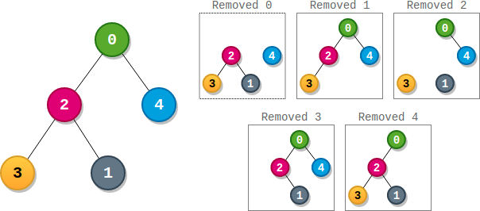

# [2049.Count Nodes With the Highest Score][title]

## Description
There is a **binary** tree rooted at `0` consisting of `n` nodes. The nodes are labeled from `0` to `n - 1`. You are given a **0-indexed** integer array `parents` representing the tree, where `parents[i]` is the parent of node `i`. Since node `0` is the root, `parents[0] == -1`.

Each node has a **score**. To find the score of a node, consider if the node and the edges connected to it were **removed**. The tree would become one or more **non-empty** subtrees. The **size** of a subtree is the number of the nodes in it. The **score** of the node is the **product of the sizes** of all those subtrees.

Return the **number** of nodes that have the **highest score**.

**Example 1:**  



```
Input: parents = [-1,2,0,2,0]
Output: 3
Explanation:
- The score of node 0 is: 3 * 1 = 3
- The score of node 1 is: 4 = 4
- The score of node 2 is: 1 * 1 * 2 = 2
- The score of node 3 is: 4 = 4
- The score of node 4 is: 4 = 4
The highest score is 4, and three nodes (node 1, node 3, and node 4) have the highest score.
```

**Example 2:**  


```
Input: parents = [-1,2,0]
Output: 2
Explanation:
- The score of node 0 is: 2 = 2
- The score of node 1 is: 2 = 2
- The score of node 2 is: 1 * 1 = 1
The highest score is 2, and two nodes (node 0 and node 1) have the highest score.
```

## 结语

如果你同我一样热爱数据结构、算法、LeetCode，可以关注我 GitHub 上的 LeetCode 题解：[awesome-golang-algorithm][me]

[title]: https://leetcode.com/problems/count-nodes-with-the-highest-score/
[me]: https://github.com/kylesliu/awesome-golang-algorithm
