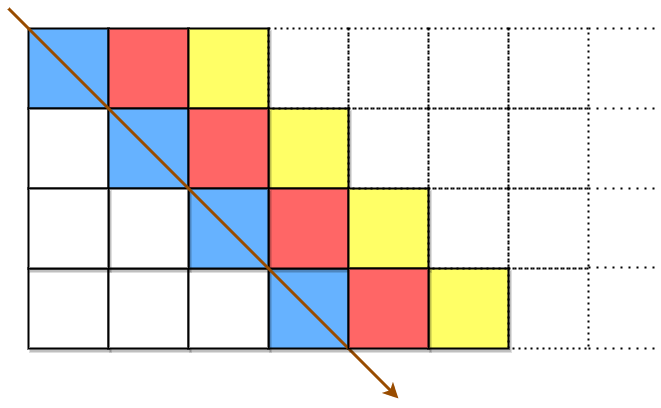
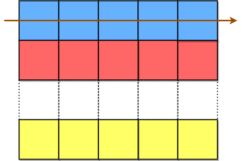
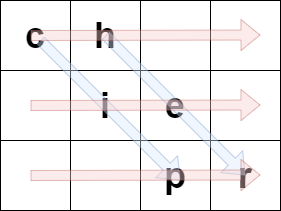
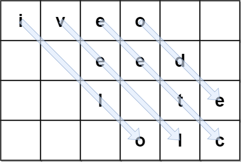
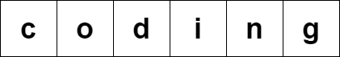

# [2075.Decode the Slanted Ciphertext][title]

## Description
A string `originalText` is encoded using a **slanted transposition cipher** to a string `encodedText` with the help of a matrix having a **fixed number of rows** `rows`.

`originalText` is placed first in a top-left to bottom-right manner.



The blue cells are filled first, followed by the red cells, then the yellow cells, and so on, until we reach the end of `originalText`. The arrow indicates the order in which the cells are filled. All empty cells are filled with `' '`. The number of columns is chosen such that the rightmost column will **not be empty** after filling in `originalText`.

`encodedText` is then formed by appending all characters of the matrix in a row-wise fashion.



The characters in the blue cells are appended first to `encodedText`, then the red cells, and so on, and finally the yellow cells. The arrow indicates the order in which the cells are accessed.

For example, if `originalText = "cipher"` and `rows = 3`, then we encode it in the following manner:



The blue arrows depict how `originalText` is placed in the matrix, and the red arrows denote the order in which `encodedText` is formed. In the above example, `encodedText = "ch ie pr"`.

Given the encoded string `encodedText` and number of rows `rows`, return the original string `originalText`.

**Note**: `originalText` **does not** have any trailing spaces `' '`. The test cases are generated such that there is only one possible `originalText`.

**Example 1:**

```
Input: encodedText = "ch   ie   pr", rows = 3
Output: "cipher"
Explanation: This is the same example described in the problem description.
```

**Example 2:**  



```
Input: encodedText = "iveo    eed   l te   olc", rows = 4
Output: "i love leetcode"
Explanation: The figure above denotes the matrix that was used to encode originalText. 
The blue arrows show how we can find originalText from encodedText.
```

**Example 3:**  



```
Input: encodedText = "coding", rows = 1
Output: "coding"
Explanation: Since there is only 1 row, both originalText and encodedText are the same.
```

## 结语

如果你同我一样热爱数据结构、算法、LeetCode，可以关注我 GitHub 上的 LeetCode 题解：[awesome-golang-algorithm][me]

[title]: https://leetcode.com/problems/decode-the-slanted-ciphertext/
[me]: https://github.com/kylesliu/awesome-golang-algorithm
