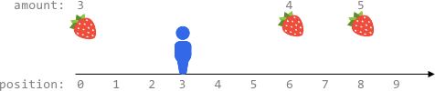

# [2106.Maximum Fruits Harvested After at Most K Steps][title]

## Description
Fruits are available at some positions on an infinite x-axis. You are given a 2D integer array `fruits` where `fruits[i] = [positioni, amounti]` depicts `amounti` fruits at the position `positioni`. `fruits` is already **sorted** by `positioni` in **ascending order**, and each `positioni` is **unique**.

You are also given an integer `startPos` and an integer `k`. Initially, you are at the position `startPos`. From any position, you can either walk to the **left or right**. It takes **one step** to move **one unit** on the x-axis, and you can walk **at most** `k` steps in total. For every position you reach, you harvest all the fruits at that position, and the fruits will disappear from that position.

Return the **maximum total number** of fruits you can harvest.

**Example 1:**  


```
Input: fruits = [[2,8],[6,3],[8,6]], startPos = 5, k = 4
Output: 9
Explanation: 
The optimal way is to:
- Move right to position 6 and harvest 3 fruits
- Move right to position 8 and harvest 6 fruits
You moved 3 steps and harvested 3 + 6 = 9 fruits in total.
```

**Example 2:**  


```
Input: fruits = [[0,9],[4,1],[5,7],[6,2],[7,4],[10,9]], startPos = 5, k = 4
Output: 14
Explanation: 
You can move at most k = 4 steps, so you cannot reach position 0 nor 10.
The optimal way is to:
- Harvest the 7 fruits at the starting position 5
- Move left to position 4 and harvest 1 fruit
- Move right to position 6 and harvest 2 fruits
- Move right to position 7 and harvest 4 fruits
You moved 1 + 3 = 4 steps and harvested 7 + 1 + 2 + 4 = 14 fruits in total.
```

**Example 3:**  



```
Input: fruits = [[0,3],[6,4],[8,5]], startPos = 3, k = 2
Output: 0
Explanation:
You can move at most k = 2 steps and cannot reach any position with fruits.
```

## 结语

如果你同我一样热爱数据结构、算法、LeetCode，可以关注我 GitHub 上的 LeetCode 题解：[awesome-golang-algorithm][me]

[title]: https://leetcode.com/problems/maximum-fruits-harvested-after-at-most-k-steps/
[me]: https://github.com/kylesliu/awesome-golang-algorithm
