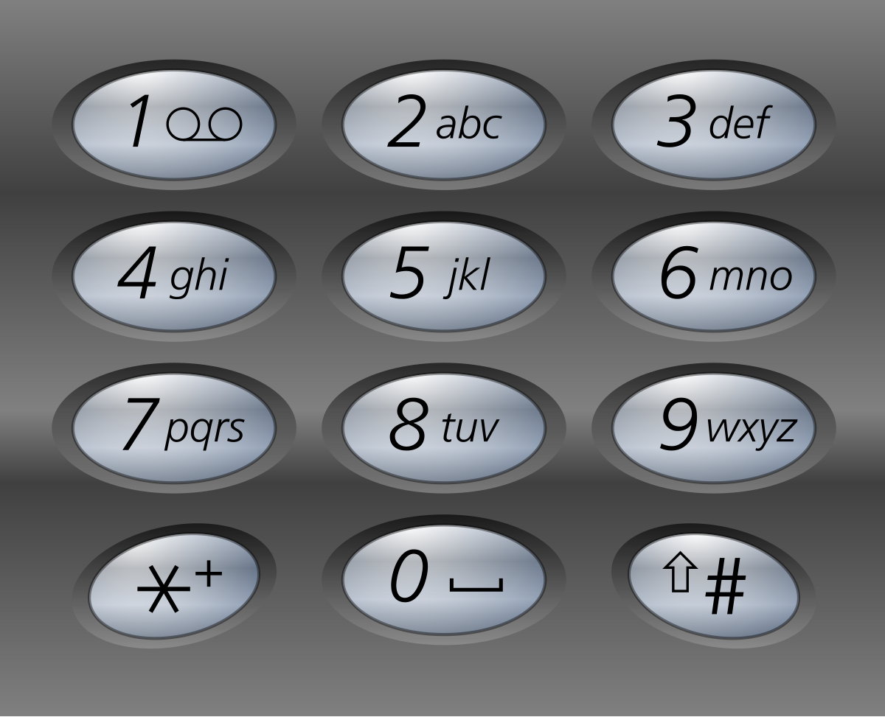

# [2266.Count Number of Texts][title]

## Description
Alice is texting Bob using her phone. The **mapping** of digits to letters is shown in the figure below.



In order to **add** a letter, Alice has to **press** the key of the corresponding digit `i` times, where i is the position of the letter in the key.

- For example, to add the letter `'s'`, Alice has to press `'7'` four times. Similarly, to add the letter `'k'`, Alice has to press `'5'` twice.
- Note that the digits `'0'` and `'1'` do not map to any letters, so Alice **does not** use them.

However, due to an error in transmission, Bob did not receive Alice's text message but received a **string of pressed keys** instead.

- For example, when Alice sent the message `"bob"`, Bob received the string `"2266622"`.

Given a string `pressedKeys` representing the string received by Bob, return the **total number of possible text messages** Alice could have sent.

Since the answer may be very large, return it **modulo** `10^9 + 7`.

**Example 1:**

```
Input: pressedKeys = "22233"
Output: 8
Explanation:
The possible text messages Alice could have sent are:
"aaadd", "abdd", "badd", "cdd", "aaae", "abe", "bae", and "ce".
Since there are 8 possible messages, we return 8.
```

**Example 2:**

```
Input: pressedKeys = "222222222222222222222222222222222222"
Output: 82876089
Explanation:
There are 2082876103 possible text messages Alice could have sent.
Since we need to return the answer modulo 109 + 7, we return 2082876103 % (109 + 7) = 82876089.
```

## 结语

如果你同我一样热爱数据结构、算法、LeetCode，可以关注我 GitHub 上的 LeetCode 题解：[awesome-golang-algorithm][me]

[title]: https://leetcode.com/problems/count-number-of-texts/
[me]: https://github.com/kylesliu/awesome-golang-algorithm
