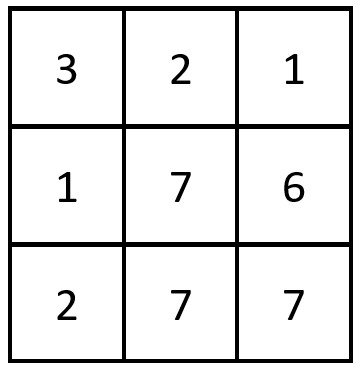
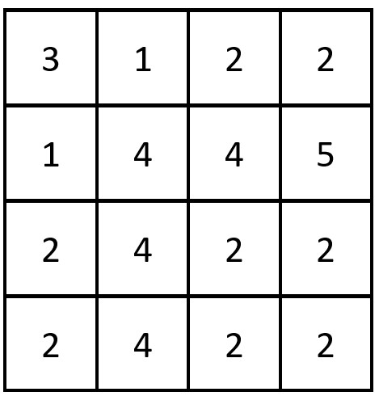

# [2352.Equal Row and Column Pairs][title]

## Description
Given a **0-indexed** `n x n` integer matrix `grid`, return the number of pairs `(ri, cj)` such that row r<sub>i</sub> and column c<sub>j</sub> are equal.

A row and column pair is considered equal if they contain the same elements in the same order (i.e., an equal array).

**Example 1:**  



```
Input: grid = [[3,2,1],[1,7,6],[2,7,7]]
Output: 1
Explanation: There is 1 equal row and column pair:
- (Row 2, Column 1): [2,7,7]
```

**Example 2:**  



```
Input: grid = [[3,1,2,2],[1,4,4,5],[2,4,2,2],[2,4,2,2]]
Output: 3
Explanation: There are 3 equal row and column pairs:
- (Row 0, Column 0): [3,1,2,2]
- (Row 2, Column 2): [2,4,2,2]
- (Row 3, Column 2): [2,4,2,2]
```

## 结语

如果你同我一样热爱数据结构、算法、LeetCode，可以关注我 GitHub 上的 LeetCode 题解：[awesome-golang-algorithm][me]

[title]: https://leetcode.com/problems/equal-row-and-column-pairs/
[me]: https://github.com/kylesliu/awesome-golang-algorithm
