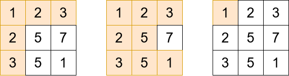
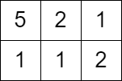

# [2503.Maximum Number of Points From Grid Queries][title]

## Description

You are given an `m x n` integer matrix `grid` and an array `queries` of size `k`.

Find an array `answer` of size k such that for each integer `queries[i]` you start in the **top left** cell of the matrix and repeat the following process:

- If `queries[i]` is **strictly** greater than the value of the current cell that you are in, then you get one point if it is your first time visiting this cell, and you can move to any **adjacent** cell in all `4` directions: up, down, left, and right.
- Otherwise, you do not get any points, and you end this process.

After the process, `answer[i]` is the **maximum** number of points you can get. **Note** that for each query you are allowed to visit the same cell **multiple** times.

Return the resulting array `answer`.

**Example 1:**  



```
Input: grid = [[1,2,3],[2,5,7],[3,5,1]], queries = [5,6,2]
Output: [5,8,1]
Explanation: The diagrams above show which cells we visit to get points for each query.
```

**EXample 2:**  



```
Input: grid = [[5,2,1],[1,1,2]], queries = [3]
Output: [0]
Explanation: We can not get any points because the value of the top left cell is already greater than or equal to 3.
```

## 结语

如果你同我一样热爱数据结构、算法、LeetCode，可以关注我 GitHub 上的 LeetCode 题解：[awesome-golang-algorithm][me]

[title]: https://leetcode.com/problems/maximum-number-of-points-from-grid-queries/
[me]: https://github.com/kylesliu/awesome-golang-algorithm
