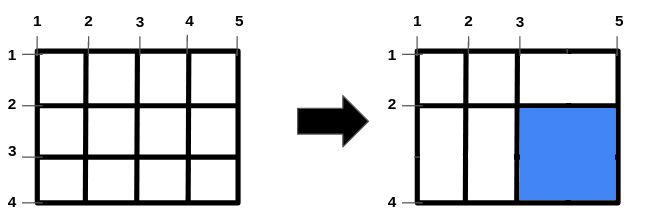

# [2943.Maximize Area of Square Hole in Grid][title]

## Description
You are given the two integers, `n` and `m` and two integer arrays, `hBars` and `vBars`. The grid has `n + 2` horizontal and `m + 2` vertical bars, creating 1 x 1 unit cells. The bars are indexed starting from `1`.

You can **remove** some of the bars in `hBars` from horizontal bars and some of the bars in `vBars` from vertical bars. Note that other bars are fixed and cannot be removed.

Return an integer denoting the **maximum area** of a square-shaped hole in the grid, after removing some bars (possibly none).

**Example 1:**  


```
Input: n = 2, m = 1, hBars = [2,3], vBars = [2]

Output: 4

Explanation:

The left image shows the initial grid formed by the bars. The horizontal bars are [1,2,3,4], and the vertical bars are [1,2,3].

One way to get the maximum square-shaped hole is by removing horizontal bar 2 and vertical bar 2.
```

**Example 2:**  


```
Input: n = 1, m = 1, hBars = [2], vBars = [2]

Output: 4

Explanation:

To get the maximum square-shaped hole, we remove horizontal bar 2 and vertical bar 2.
```

**Example 3:**  



```
Input: n = 2, m = 3, hBars = [2,3], vBars = [2,4]

Output: 4

Explanation:

One way to get the maximum square-shaped hole is by removing horizontal bar 3, and vertical bar 4.
```

## 结语

如果你同我一样热爱数据结构、算法、LeetCode，可以关注我 GitHub 上的 LeetCode 题解：[awesome-golang-algorithm][me]

[title]: https://leetcode.com/problems/maximize-area-of-square-hole-in-grid/
[me]: https://github.com/kylesliu/awesome-golang-algorithm
