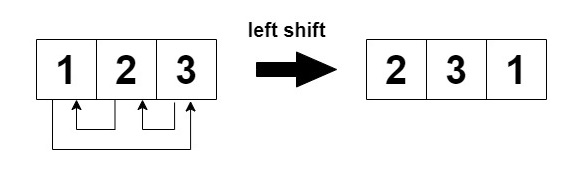
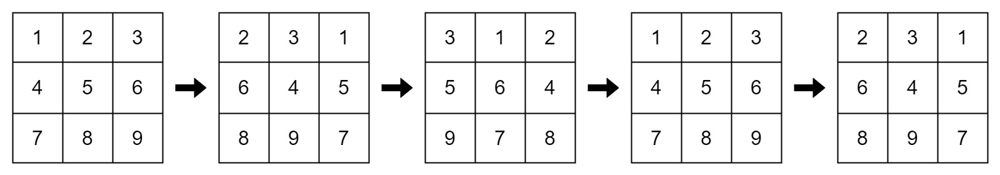

# [2946.Matrix Similarity After Cyclic Shifts][title]

## Description
You are given an `m x n` integer matrix `mat` and an integer `k`. The matrix rows are 0-indexed.

The following proccess happens `k` times:

- **Even-indexed** rows (0, 2, 4, ...) are cyclically shifted to the left.



- **Odd-indexed** rows (1, 3, 5, ...) are cyclically shifted to the right.


Return `true` if the final modified matrix after `k` steps is identical to the original matrix, and `false` otherwise.

**Example 1:**  



```
Input: mat = [[1,2,3],[4,5,6],[7,8,9]], k = 4

Output: false

Explanation:

In each step left shift is applied to rows 0 and 2 (even indices), and right shift to row 1 (odd index).
```

**Example 2:**  


```
Input: mat = [[1,2,1,2],[5,5,5,5],[6,3,6,3]], k = 2

Output: true

Explanation:
```

**Example 3:**

```
Input: mat = [[2,2],[2,2]], k = 3

Output: true

Explanation:

As all the values are equal in the matrix, even after performing cyclic shifts the matrix will remain the same.
```

## 结语

如果你同我一样热爱数据结构、算法、LeetCode，可以关注我 GitHub 上的 LeetCode 题解：[awesome-golang-algorithm][me]

[title]: https://leetcode.com/problems/matrix-similarity-after-cyclic-shifts/
[me]: https://github.com/kylesliu/awesome-golang-algorithm
