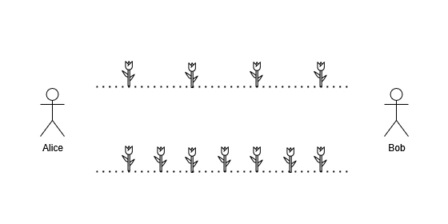

# [3021.Alice and Bob Playing Flower Game][title]

## Description
Alice and Bob are playing a turn-based game on a field, with two lanes of flowers between them. There are `x` flowers in the first lane between Alice and Bob, and `y` flowers in the second lane between them.



The game proceeds as follows:

1. Alice takes the first turn.
2. In each turn, a player must choose either one of the lane and pick one flower from that side.
3. At the end of the turn, if there are no flowers left at all, the current player captures their opponent and wins the game.

Given two integers, `n` and `m`, the task is to compute the number of possible pairs `(x, y)` that satisfy the conditions:

- Alice must win the game according to the described rules.
- The number of flowers `x` in the first lane must be in the range `[1,n]`.
- The number of flowers `y` in the second lane must be in the range `[1,m]`.

Return the number of possible pairs `(x, y)` that satisfy the conditions mentioned in the statement.

**Example 1:**

```
Input: n = 3, m = 2
Output: 3
Explanation: The following pairs satisfy conditions described in the statement: (1,2), (3,2), (2,1).
```

**Example 2:**

```
Input: n = 1, m = 1
Output: 0
Explanation: No pairs satisfy the conditions described in the statement.
```

## 结语

如果你同我一样热爱数据结构、算法、LeetCode，可以关注我 GitHub 上的 LeetCode 题解：[awesome-golang-algorithm][me]

[title]: https://leetcode.com/problems/alice-and-bob-playing-flower-game/
[me]: https://github.com/kylesliu/awesome-golang-algorithm
