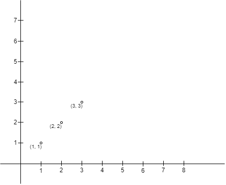
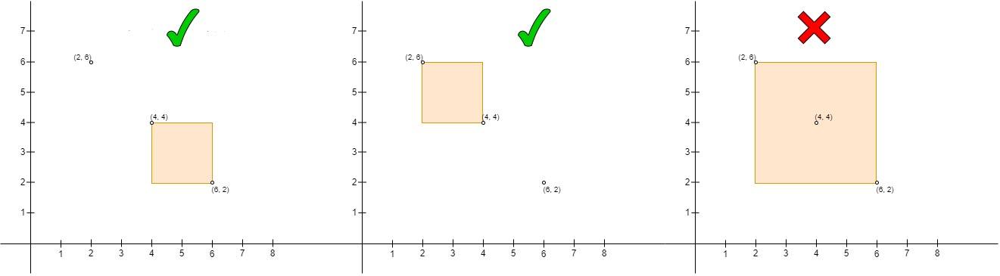
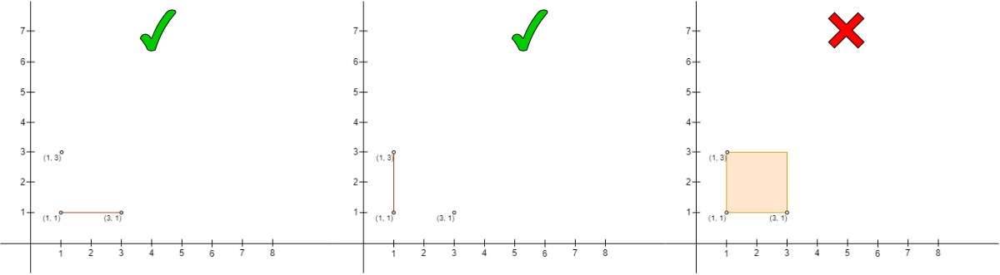

# [3025.Find the Number of Ways to Place People I][title]

## Description
You are given a 2D array `points` of size `n x 2` representing integer coordinates of some points on a 2D plane, where `points[i] = [xi, yi]`.

Count the number of pairs of points `(A, B)`, where

- `A` is on the **upper left** side of `B`, and
- there are no other points in the rectangle (or line) they make (**including the border**).

Return the count.

**Example 1:**  



```
Input: points = [[1,1],[2,2],[3,3]]

Output: 0

Explanation:

There is no way to choose A and B so A is on the upper left side of B.
```

**Example 2:**  



```
Input: points = [[6,2],[4,4],[2,6]]

Output: 2

Explanation:

The left one is the pair (points[1], points[0]), where points[1] is on the upper left side of points[0] and the rectangle is empty.
The middle one is the pair (points[2], points[1]), same as the left one it is a valid pair.
The right one is the pair (points[2], points[0]), where points[2] is on the upper left side of points[0], but points[1] is inside the rectangle so it's not a valid pair.
```

**Example 3:**  



```
Input: points = [[3,1],[1,3],[1,1]]

Output: 2

Explanation:

The left one is the pair (points[2], points[0]), where points[2] is on the upper left side of points[0] and there are no other points on the line they form. Note that it is a valid state when the two points form a line.
The middle one is the pair (points[1], points[2]), it is a valid pair same as the left one.
The right one is the pair (points[1], points[0]), it is not a valid pair as points[2] is on the border of the rectangle.
```

## 结语

如果你同我一样热爱数据结构、算法、LeetCode，可以关注我 GitHub 上的 LeetCode 题解：[awesome-golang-algorithm][me]

[title]: https://leetcode.com/problems/find-the-number-of-ways-to-place-people-i/
[me]: https://github.com/kylesliu/awesome-golang-algorithm
