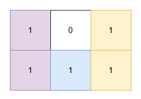

# [3197.Find the Minimum Area to Cover All Ones II][title]

## Description
You are given a 2D **binary** array `grid`. You need to find 3 **non-overlapping** rectangles having **non-zero** areas with horizontal and vertical sides such that all the 1's in `grid` lie inside these rectangles.

Return the **minimum** possible sum of the area of these rectangles.

**Note** that the rectangles are allowed to touch.

**Example 1:**  



```
Input: grid = [[1,0,1],[1,1,1]]

Output: 5

Explanation:

The 1's at (0, 0) and (1, 0) are covered by a rectangle of area 2.
The 1's at (0, 2) and (1, 2) are covered by a rectangle of area 2.
The 1 at (1, 1) is covered by a rectangle of area 1.
```

**Example 2:**  


```
Input: grid = [[1,0,1,0],[0,1,0,1]]

Output: 5

Explanation:

The 1's at (0, 0) and (0, 2) are covered by a rectangle of area 3.
The 1 at (1, 1) is covered by a rectangle of area 1.
The 1 at (1, 3) is covered by a rectangle of area 1.
```

## 结语

如果你同我一样热爱数据结构、算法、LeetCode，可以关注我 GitHub 上的 LeetCode 题解：[awesome-golang-algorithm][me]

[title]: https://leetcode.com/problems/find-the-minimum-area-to-cover-all-ones-ii/
[me]: https://github.com/kylesliu/awesome-golang-algorithm
