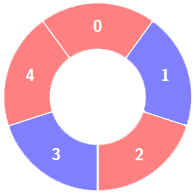
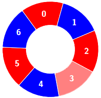

# [3208.Alternating Groups II][title]

## Description
There is a circle of red and blue tiles. You are given an array of integers `colors` and an integer `k`. The color of tile i is represented by `colors[i]`:

- `colors[i] == 0` means that tile `i` is **red**.
- `colors[i] == 1` means that tile `i` is **blue**.

An **alternating** group is every k contiguous tiles in the circle with **alternating** colors (each tile in the group except the first and last one has a different color from its **left** and **right** tiles).

Return the number of **alternating** groups.

**Note** that since `colors` represents a **circle**, the **first** and the **last** tiles are considered to be next to each other.

**Example 1:**  




```
Input: colors = [0,1,0,1,0], k = 3

Output: 3
```

**Example 2:**  





```
Input: colors = [0,1,0,0,1,0,1], k = 6


Output: 2
```

**Example 3:**  


```
Input: colors = [1,1,0,1], k = 4

Output: 0
```

## 结语

如果你同我一样热爱数据结构、算法、LeetCode，可以关注我 GitHub 上的 LeetCode 题解：[awesome-golang-algorithm][me]

[title]: https://leetcode.com/problems/alternating-groups-ii/
[me]: https://github.com/kylesliu/awesome-golang-algorithm
