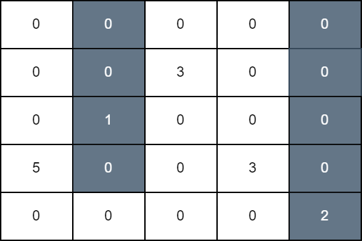

# [3225.Maximum Score From Grid Operations][title]

## Description
You are given a 2D matrix `grid` of size `n x n`. Initially, all cells of the grid are colored white. In one operation, you can select any cell of indices `(i, j)`, and color black all the cells of the `jth` column starting from the top row down to the `ith` row.

The grid score is the sum of all `grid[i][j]` such that cell `(i, j)` is white and it has a horizontally adjacent black cell.

Return the **maximum** score that can be achieved after some number of operations.

**Example 1:**  



```
Input: grid = [[0,0,0,0,0],[0,0,3,0,0],[0,1,0,0,0],[5,0,0,3,0],[0,0,0,0,2]]

Output: 11

Explanation:

In the first operation, we color all cells in column 1 down to row 3, and in the second operation, we color all cells in column 4 down to the last row. The score of the resulting grid is grid[3][0] + grid[1][2] + grid[3][3] which is equal to 11.
```

**Example 2:**  


```
Input: grid = [[10,9,0,0,15],[7,1,0,8,0],[5,20,0,11,0],[0,0,0,1,2],[8,12,1,10,3]]

Output: 94

Explanation:

We perform operations on 1, 2, and 3 down to rows 1, 4, and 0, respectively. The score of the resulting grid is grid[0][0] + grid[1][0] + grid[2][1] + grid[4][1] + grid[1][3] + grid[2][3] + grid[3][3] + grid[4][3] + grid[0][4] which is equal to 94.
```

## 结语

如果你同我一样热爱数据结构、算法、LeetCode，可以关注我 GitHub 上的 LeetCode 题解：[awesome-golang-algorithm][me]

[title]: https://leetcode.com/problems/maximum-score-from-grid-operations/
[me]: https://github.com/kylesliu/awesome-golang-algorithm
