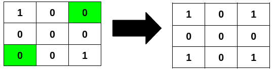

# [3239.Minimum Number of Flips to Make Binary Grid Palindromic I][title]

## Description
You are given an `m x n` binary matrix `grid`.

A row or column is considered `palindromic` if its values read the same forward and backward.

You can **flip** any number of cells in `grid` from `0` to `1`, or from `1` to `0`.

Return the **minimum** number of cells that need to be flipped to make **either** all rows **palindromic** or all columns **palindromic**.


**Example 1:**  



```
Input: grid = [[1,0,0],[0,0,0],[0,0,1]]

Output: 2

Explanation:

Flipping the highlighted cells makes all the rows palindromic.
```

**Example 2:**  


```
Input: grid = [[0,1],[0,1],[0,0]]

Output: 1

Explanation:

Flipping the highlighted cell makes all the columns palindromic.
```

**Example 3:**

```
Input: grid = [[1],[0]]

Output: 0

Explanation:

All rows are already palindromic.
```

## 结语

如果你同我一样热爱数据结构、算法、LeetCode，可以关注我 GitHub 上的 LeetCode 题解：[awesome-golang-algorithm][me]

[title]: https://leetcode.com/problems/minimum-number-of-flips-to-make-binary-grid-palindromic-i/
[me]: https://github.com/kylesliu/awesome-golang-algorithm
