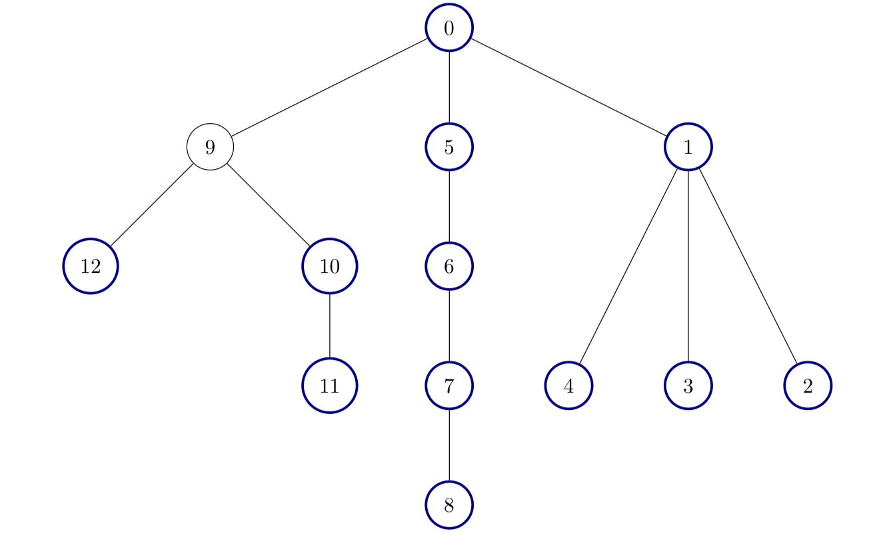

# [3249.Count the Number of Good Nodes][title]

## Description
There is an **undirected** tree with `n` nodes labeled from `0` to `n - 1`, and rooted at node `0`. You are given a 2D integer array `edges` of length `n - 1`, where `edges[i] = [ai, bi]` indicates that there is an edge between nodes `ai` and `bi` in the tree.

A node is **good** if all the subtrees rooted at its children have the same size.

Return the number of **good** nodes in the given tree.

A **subtree** of `treeName` is a tree consisting of a node in `treeName` and all of its descendants.

**Example 1:**  


```
Input: edges = [[0,1],[0,2],[1,3],[1,4],[2,5],[2,6]]

Output: 7
```

**Example 2:**  


```
Input: edges = [[0,1],[1,2],[2,3],[3,4],[0,5],[1,6],[2,7],[3,8]]

Output: 6
```

**Example 3:**  



```
Input: edges = [[0,1],[1,2],[1,3],[1,4],[0,5],[5,6],[6,7],[7,8],[0,9],[9,10],[9,12],[10,11]]

Output: 12
```

## 结语

如果你同我一样热爱数据结构、算法、LeetCode，可以关注我 GitHub 上的 LeetCode 题解：[awesome-golang-algorithm][me]

[title]: https://leetcode.com/problems/count-the-number-of-good-nodes/
[me]: https://github.com/kylesliu/awesome-golang-algorithm
