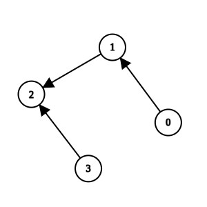
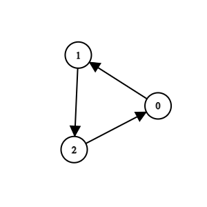

# [3310.Remove Methods From Project][title]

## Description
You are maintaining a project that has `n` methods numbered from `0` to `n - 1`.

You are given two integers `n` and `k`, and a 2D integer array `invocations`, where `invocations[i] = [ai, bi]` indicates that method `ai` invokes method `bi`.

There is a known bug in method `k`. Method `k`, along with any method invoked by it, either **directly** or **indirectly**, are considered **suspicious** and we aim to remove them.

A group of methods can only be removed if no method **outside** the group invokes any methods **within** it.

Return an array containing all the remaining methods after removing all the **suspicious** methods. You may return the answer in any order. If it is not possible to remove **all** the suspicious methods, **none** should be removed.

**Example 1:**  



```
Input: n = 4, k = 1, invocations = [[1,2],[0,1],[3,2]]

Output: [0,1,2,3]

Explanation:

Method 2 and method 1 are suspicious, but they are directly invoked by methods 3 and 0, which are not suspicious. We return all elements without removing anything.
```

**Example 2:**  


```
Input: n = 5, k = 0, invocations = [[1,2],[0,2],[0,1],[3,4]]

Output: [3,4]

Explanation:

Methods 0, 1, and 2 are suspicious and they are not directly invoked by any other method. We can remove them.
```

**Example 3:**  



```
Input: n = 3, k = 2, invocations = [[1,2],[0,1],[2,0]]

Output: []

Explanation:

All methods are suspicious. We can remove them.
```

## 结语

如果你同我一样热爱数据结构、算法、LeetCode，可以关注我 GitHub 上的 LeetCode 题解：[awesome-golang-algorithm][me]

[title]: https://leetcode.com/problems/remove-methods-from-project/
[me]: https://github.com/kylesliu/awesome-golang-algorithm
