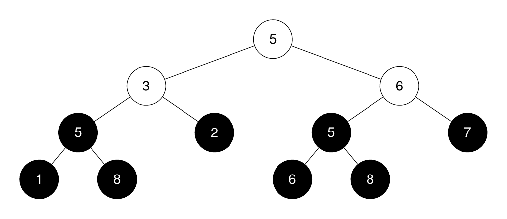
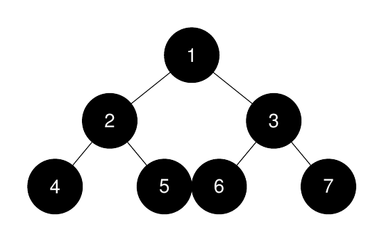
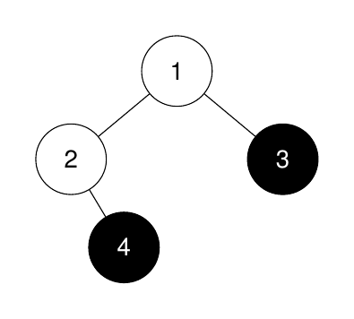

# [3319.K-th Largest Perfect Subtree Size in Binary Tree][title]

## Description

You are given the `root` of a **binary tree** and an integer `k`.

Return an integer denoting the size of the `kth` **largest perfect binary subtree**, or `-1` if it doesn't exist.

A **perfect binary tree** is a tree where all leaves are on the same level, and every parent has two children.

**Example 1:**  



```
Input: root = [5,3,6,5,2,5,7,1,8,null,null,6,8], k = 2

Output: 3

Explanation:

The roots of the perfect binary subtrees are highlighted in black. Their sizes, in non-increasing order are [3, 3, 1, 1, 1, 1, 1, 1].
The 2nd largest size is 3.
```

**Example 2:**  



```
Input: root = [1,2,3,4,5,6,7], k = 1

Output: 7

Explanation:

The sizes of the perfect binary subtrees in non-increasing order are [7, 3, 3, 1, 1, 1, 1]. The size of the largest perfect binary subtree is 7.
```

**Example 3:**  



```
Input: root = [1,2,3,null,4], k = 3

Output: -1

Explanation:

The sizes of the perfect binary subtrees in non-increasing order are [1, 1]. There are fewer than 3 perfect binary subtrees.
```

## 结语

如果你同我一样热爱数据结构、算法、LeetCode，可以关注我 GitHub 上的 LeetCode 题解：[awesome-golang-algorithm][me]

[title]: https://leetcode.com/problems/k-th-largest-perfect-subtree-size-in-binary-tree/
[me]: https://github.com/kylesliu/awesome-golang-algorithm
