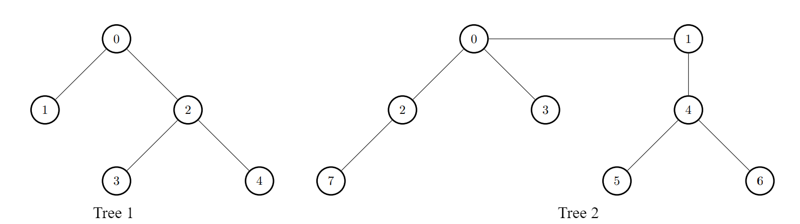

# [3372.Maximize the Number of Target Nodes After Connecting Trees I][title]

## Description
There exist two **undirected** trees with `n` and `m` nodes, with **distinct** labels in ranges `[0, n - 1]` and `[0, m - 1]`, respectively.

You are given two 2D integer arrays `edges1` and `edges2` of lengths `n - 1` and `m - 1`, respectively, where `edges1[i] = [ai, bi]` indicates that there is an edge between nodes `ai` and `bi` in the first tree and `edges2[i] = [ui, vi]` indicates that there is an edge between nodes `ui` and `vi` in the second tree. You are also given an integer `k`.

Node `u` is **target** to node `v` if the number of edges on the path from `u` to `v` is less than or equal to `k`. **Note** that a node is always **target** to itself.

Return an array of n integers `answer`, where `answer[i]` is the **maximum** possible number of nodes **target** to node `i` of the first tree if you have to connect one node from the first tree to another node in the second tree.

Note that queries are independent from each other. That is, for every query you will remove the added edge before proceeding to the next query.

**Example 1:**  



```
Input: edges1 = [[0,1],[0,2],[2,3],[2,4]], edges2 = [[0,1],[0,2],[0,3],[2,7],[1,4],[4,5],[4,6]], k = 2

Output: [9,7,9,8,8]

Explanation:

For i = 0, connect node 0 from the first tree to node 0 from the second tree.
For i = 1, connect node 1 from the first tree to node 0 from the second tree.
For i = 2, connect node 2 from the first tree to node 4 from the second tree.
For i = 3, connect node 3 from the first tree to node 4 from the second tree.
For i = 4, connect node 4 from the first tree to node 4 from the second tree.
```

**Example 2:**  


```
Input: edges1 = [[0,1],[0,2],[0,3],[0,4]], edges2 = [[0,1],[1,2],[2,3]], k = 1

Output: [6,3,3,3,3]

Explanation:

For every i, connect node i of the first tree with any node of the second tree.
```

## 结语

如果你同我一样热爱数据结构、算法、LeetCode，可以关注我 GitHub 上的 LeetCode 题解：[awesome-golang-algorithm][me]

[title]: https://leetcode.com/problems/maximize-the-number-of-target-nodes-after-connecting-trees-i/
[me]: https://github.com/kylesliu/awesome-golang-algorithm
