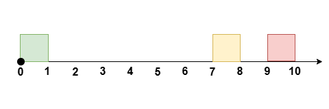

# [3440.Reschedule Meetings for Maximum Free Time II][title]

## Description
You are given an integer `eventTime` denoting the duration of an event. You are also given two integer arrays `startTime` and `endTime`, each of length `n`.

These represent the start and end times of `n` **non-overlapping** meetings that occur during the event between time `t = 0` and time `t = eventTime`, where the `ith` meeting occurs during the time `[startTime[i], endTime[i]]`.

You can reschedule **at most** one meeting by moving its start time while maintaining the **same duration**, such that the meetings remain non-overlapping, to **maximize** the **longest** continuous period of free time during the event.

Return the **maximum** amount of free time possible after rearranging the meetings.

**Note** that the meetings can **not** be rescheduled to a time outside the event and they should remain non-overlapping.

**Note**: In this version, it is **valid** for the relative ordering of the meetings to change after rescheduling one meeting.

**Example 1:**  


```
Input: eventTime = 5, startTime = [1,3], endTime = [2,5]

Output: 2

Explanation:

Reschedule the meeting at [1, 2] to [2, 3], leaving no meetings during the time [0, 2].
```

**Example 2:**  



```
Input: eventTime = 10, startTime = [0,7,9], endTime = [1,8,10]

Output: 7

Explanation:

Reschedule the meeting at [0, 1] to [8, 9], leaving no meetings during the time [0, 7].
```

**Example 3:**  


```
Input: eventTime = 10, startTime = [0,3,7,9], endTime = [1,4,8,10]

Output: 6

Explanation:

Reschedule the meeting at [3, 4] to [8, 9], leaving no meetings during the time [1, 7].
```

**Example 4:**

```
Input: eventTime = 5, startTime = [0,1,2,3,4], endTime = [1,2,3,4,5]

Output: 0

Explanation:

There is no time during the event not occupied by meetings.
```

## 结语

如果你同我一样热爱数据结构、算法、LeetCode，可以关注我 GitHub 上的 LeetCode 题解：[awesome-golang-algorithm][me]

[title]: https://leetcode.com/problems/reschedule-meetings-for-maximum-free-time-ii/
[me]: https://github.com/kylesliu/awesome-golang-algorithm
