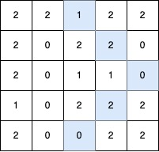

# [3459.Length of Longest V-Shaped Diagonal Segment][title]

## Description
You are given a 2D integer matrix `grid` of size `n x m`, where each element is either `0`, `1`, or `2`.

A **V-shaped diagonal segment** is defined as:

- The segment starts with `1`.
- The subsequent elements follow this infinite sequence: `2, 0, 2, 0, ...`.
- The segment:

    - Starts **along** a diagonal direction (top-left to bottom-right, bottom-right to top-left, top-right to bottom-left, or bottom-left to top-right).
    - Continues the **sequence** in the same diagonal direction.
    - Makes **at most one clockwise 90-degree turn** to another diagonal direction while **maintaining** the sequence.


Return the **length** of the **longest V-shaped diagonal segment**. If no valid segment exists, return 0.

**Example 1:**  



```
Input: grid = [[2,2,1,2,2],[2,0,2,2,0],[2,0,1,1,0],[1,0,2,2,2],[2,0,0,2,2]]

Output: 5

Explanation:

The longest V-shaped diagonal segment has a length of 5 and follows these coordinates: (0,2) → (1,3) → (2,4), takes a 90-degree clockwise turn at (2,4), and continues as (3,3) → (4,2).
```

**Example 2:**  


```
Input: grid = [[2,2,2,2,2],[2,0,2,2,0],[2,0,1,1,0],[1,0,2,2,2],[2,0,0,2,2]]

Output: 4

Explanation:

The longest V-shaped diagonal segment has a length of 4 and follows these coordinates: (2,3) → (3,2), takes a 90-degree clockwise turn at (3,2), and continues as (2,1) → (1,0).
```

**Example 3:**  


```
Input: grid = [[1,2,2,2,2],[2,2,2,2,0],[2,0,0,0,0],[0,0,2,2,2],[2,0,0,2,0]]

Output: 5

Explanation:

The longest V-shaped diagonal segment has a length of 5 and follows these coordinates: (0,0) → (1,1) → (2,2) → (3,3) → (4,4).
```

**Example 4:**

```
Input: grid = [[1]]

Output: 1

Explanation:

The longest V-shaped diagonal segment has a length of 1 and follows these coordinates: (0,0).
```

## 结语

如果你同我一样热爱数据结构、算法、LeetCode，可以关注我 GitHub 上的 LeetCode 题解：[awesome-golang-algorithm][me]

[title]: https://leetcode.com/problems/length-of-longest-v-shaped-diagonal-segment/
[me]: https://github.com/kylesliu/awesome-golang-algorithm
