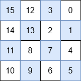

# [3537.Fill a Special Grid][title]

## Description
You are given a non-negative integer `n` representing a `2^n x 2^n` grid. You must fill the grid with integers from 0 to `2^2n - 1` to make it **special**. A grid is special if it satisfies **all** the following conditions:

- All numbers in the top-right quadrant are smaller than those in the bottom-right quadrant.
- All numbers in the bottom-right quadrant are smaller than those in the bottom-left quadrant.
- All numbers in the bottom-left quadrant are smaller than those in the top-left quadrant.
- Each of its quadrants is also a special grid.

Return the **special** `2^n x 2^n` grid.

**Note**: Any 1x1 grid is special.

**Example 1:**

```
Input: n = 0

Output: [[0]]

Explanation:

The only number that can be placed is 0, and there is only one possible position in the grid.
```

**Example 2:**

```
Input: n = 1

Output: [[3,0],[2,1]]

Explanation:

The numbers in each quadrant are:

Top-right: 0
Bottom-right: 1
Bottom-left: 2
Top-left: 3
Since 0 < 1 < 2 < 3, this satisfies the given constraints.
```

**Example 3:**  



```
Input: n = 2

Output: [[15,12,3,0],[14,13,2,1],[11,8,7,4],[10,9,6,5]]

Explanation:

The numbers in each quadrant are:

Top-right: 3, 0, 2, 1
Bottom-right: 7, 4, 6, 5
Bottom-left: 11, 8, 10, 9
Top-left: 15, 12, 14, 13
max(3, 0, 2, 1) < min(7, 4, 6, 5)
max(7, 4, 6, 5) < min(11, 8, 10, 9)
max(11, 8, 10, 9) < min(15, 12, 14, 13)
This satisfies the first three requirements. Additionally, each quadrant is also a special grid. Thus, this is a special grid.
```

## 结语

如果你同我一样热爱数据结构、算法、LeetCode，可以关注我 GitHub 上的 LeetCode 题解：[awesome-golang-algorithm][me]

[title]: https://leetcode.com/problems/fill-a-special-grid/
[me]: https://github.com/kylesliu/awesome-golang-algorithm
