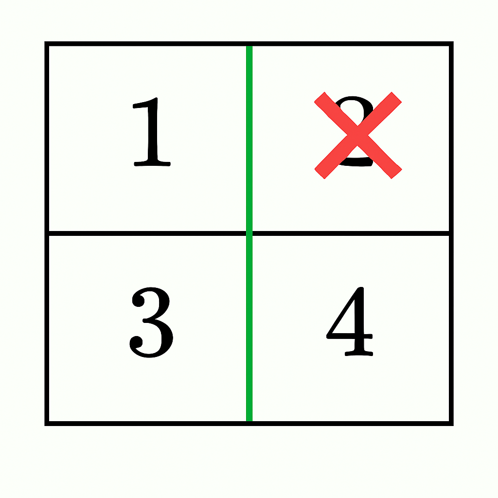
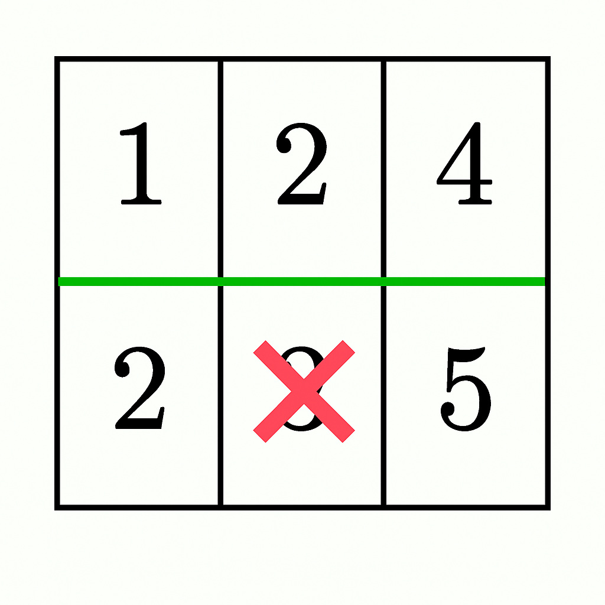

# [3548.Equal Sum Grid Partition II][title]

## Description
You are given an `m x n` matrix grid of positive integers. Your task is to determine if it is possible to make **either one horizontal or one vertical cut** on the grid such that:

- Each of the two resulting sections formed by the cut is **non-empty**.
- The sum of elements in both sections is **equal**, or can be made equal by discounting **at most** one single cell in total (from either section).
- If a cell is discounted, the rest of the section must **remain** connected.

Return `true` if such a partition exists; otherwise, return `false`.

**Note**: A section is **connected** if every cell in it can be reached from any other cell by moving up, down, left, or right through other cells in the section.

**Example 1:**  


```
Input: grid = [[1,4],[2,3]]

Output: true

Explanation:

A horizontal cut after the first row gives sums 1 + 4 = 5 and 2 + 3 = 5, which are equal. Thus, the answer is true.
```

**Example 2:**  



```
Input: grid = [[1,2],[3,4]]

Output: true

Explanation:

A vertical cut after the first column gives sums 1 + 3 = 4 and 2 + 4 = 6.
By discounting 2 from the right section (6 - 2 = 4), both sections have equal sums and remain connected. Thus, the answer is true.
```

**Example 3:**  



```
Input: grid = [[1,2,4],[2,3,5]]

Output: false

Explanation:

A horizontal cut after the first row gives 1 + 2 + 4 = 7 and 2 + 3 + 5 = 10.
By discounting 3 from the bottom section (10 - 3 = 7), both sections have equal sums, but they do not remain connected as it splits the bottom section into two parts ([2] and [5]). Thus, the answer is false.
```

**Example 4:**

```
Input: grid = [[4,1,8],[3,2,6]]

Output: false

Explanation:

No valid cut exists, so the answer is false.
```

## 结语

如果你同我一样热爱数据结构、算法、LeetCode，可以关注我 GitHub 上的 LeetCode 题解：[awesome-golang-algorithm][me]

[title]: https://leetcode.com/problems/equal-sum-grid-partition-ii/
[me]: https://github.com/kylesliu/awesome-golang-algorithm
