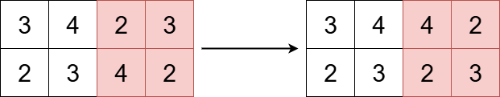

# [3643.Flip Square Submatrix Vertically][title]

## Description
You are given an `m x n` integer matrix `grid`, and three integers `x`, `y`, and `k`.

The integers `x` and `y` represent the row and column indices of the **top-left** corner of a **square** submatrix and the integer `k` represents the size (side length) of the square submatrix.

Your task is to flip the submatrix by reversing the order of its rows vertically.

Return the updated matrix.

**Example 1:**  


```
Input: grid = [[1,2,3,4],[5,6,7,8],[9,10,11,12],[13,14,15,16]], x = 1, y = 0, k = 3

Output: [[1,2,3,4],[13,14,15,8],[9,10,11,12],[5,6,7,16]]

Explanation:

The diagram above shows the grid before and after the transformation.
```

**Example 2:**  



```
Input: grid = [[3,4,2,3],[2,3,4,2]], x = 0, y = 2, k = 2

Output: [[3,4,4,2],[2,3,2,3]]

Explanation:

The diagram above shows the grid before and after the transformation.
```

## 结语

如果你同我一样热爱数据结构、算法、LeetCode，可以关注我 GitHub 上的 LeetCode 题解：[awesome-golang-algorithm][me]

[title]: https://leetcode.com/problems/flip-square-submatrix-vertically/
[me]: https://github.com/kylesliu/awesome-golang-algorithm
